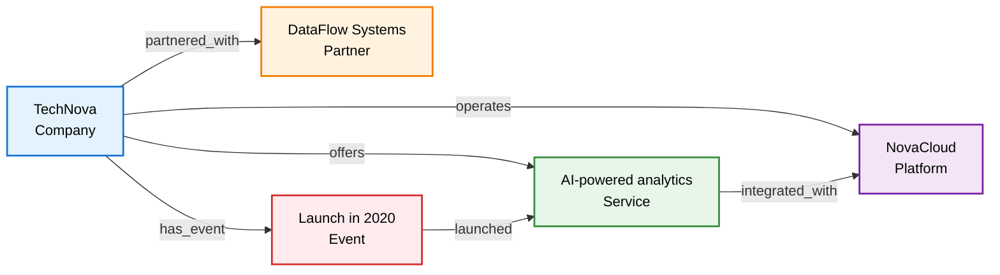
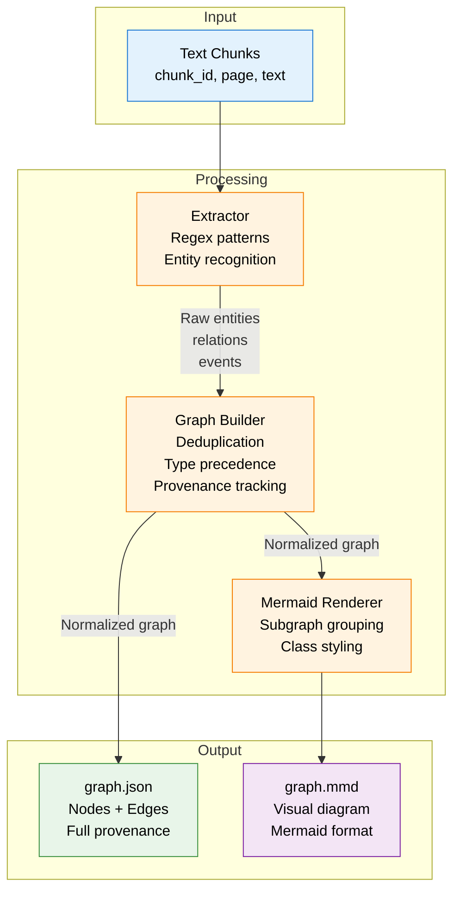
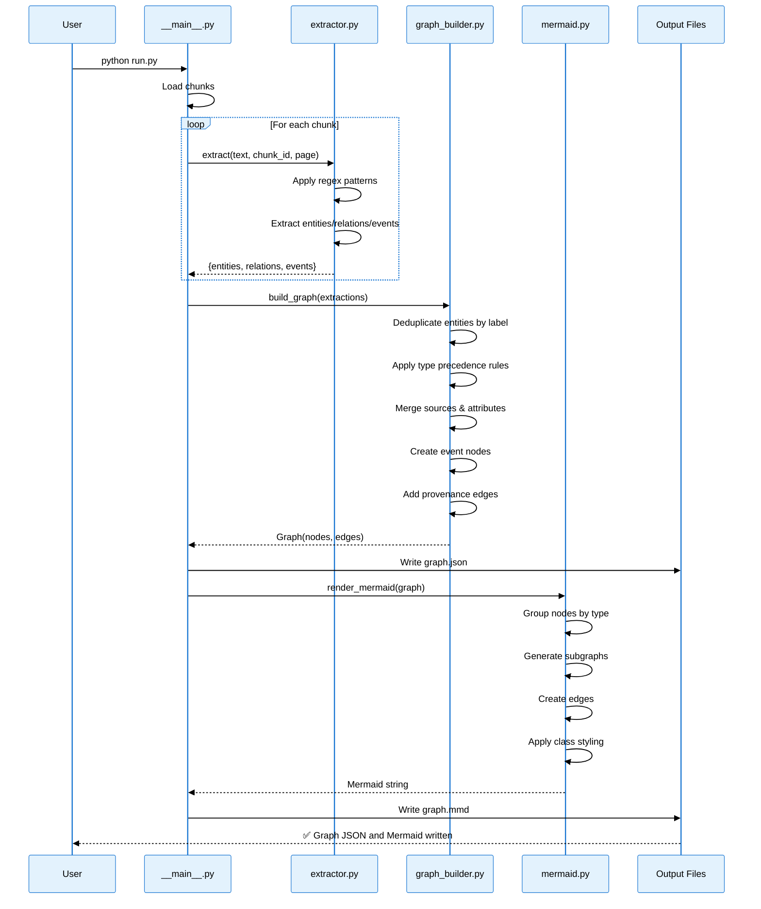
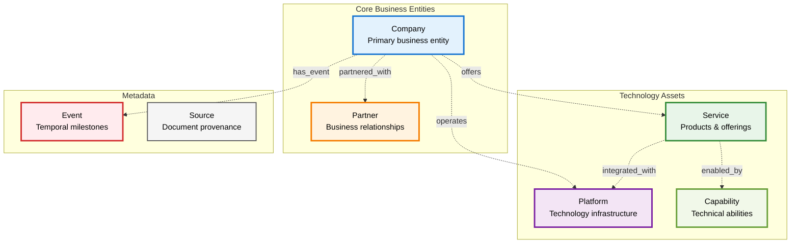
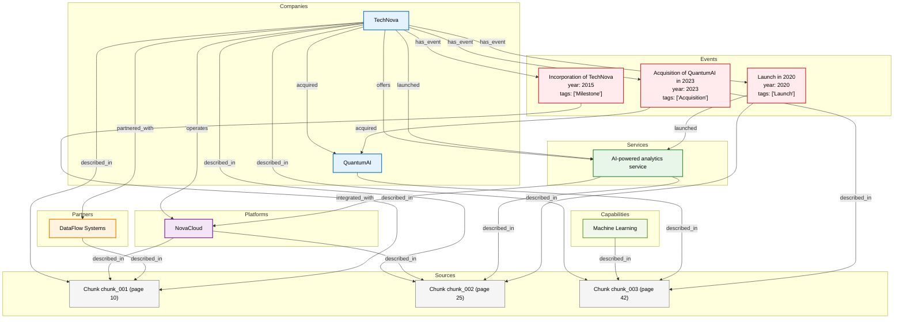

# Graph Builder - Knowledge Graph Extraction System

A production-ready knowledge graph extraction system that transforms unstructured text into structured, queryable graphs with full provenance tracking.

## 🚀 Quick Reference

| Command | Description |
|---------|-------------|
| `python run.py` | Run from inside graph_builder folder |
| `python -m graph_builder` | Run from parent directory |
| **Output** | `graph.json` + `graph.mmd` in current directory |
| **Visualization** | Paste `graph.mmd` into [Mermaid Live](https://mermaid.live) |

## Overview

Graph Builder extracts entities, relationships, and events from document chunks and builds a normalized knowledge graph with:

- **Entity deduplication** across chunks
- **Type-safe schema** (Companies, Platforms, Services, Partners, Capabilities, Events, Sources)
- **Full provenance tracking** (every node/edge links back to source chunks)
- **Mermaid visualization** with semantic grouping and professional styling
- **Graph RAG retrieval** for context-aware querying

### Visual Example: Input → Output

**Input Text:**
```
TechNova Inc. was founded in 2015 and operates a cloud platform called NovaCloud.
TechNova has partnered with DataFlow Systems.
In 2020, TechNova launched its AI-powered analytics service, integrated with NovaCloud.
```

**Output Graph:**



## Quick Start

### Installation

```bash
# Clone or download this folder
cd graph_builder

# No external dependencies required for core pipeline (uses Python stdlib only)

# Optional: Install Streamlit for the validation UI
pip install -r requirements-ui.txt

# Optional: Create .env file for LLM mode
cp .env.example .env
# Edit .env and add your GEMINI_API_KEY
```

**For Streamlit Cloud deployment, see [DEPLOYMENT.md](../DEPLOYMENT.md)**

**For detailed setup instructions, see [STREAMLIT_GUIDE.md](STREAMLIT_GUIDE.md)**

### Run the Demo

```bash
# From inside the graph_builder folder
python run.py
```

Or from the parent directory:

```bash
python -m graph_builder
```

This will:
1. Extract entities and relations from sample chunks
2. Build a normalized knowledge graph
3. Generate `graph.json` and `graph.mmd` in the current directory
4. Print statistics and demo retrieval results

### Run the Validation UI (Optional)

```bash
# From the PARENT directory of graph_builder
streamlit run graph_builder/streamlit_app.py
```

The Streamlit UI provides:
- Interactive testing with custom text chunks
- Toggle between rule-based and LLM-based extraction
- Visual inspection of graph JSON and Mermaid diagrams
- Statistics and validation checklist
- Export functionality for generated graphs

**Note:** Run from the parent directory to ensure proper package imports.

### Output Files

- **graph.json** - Complete graph structure with nodes, edges, and provenance
- **graph.mmd** - Mermaid diagram for visualization (paste into [Mermaid Live Editor](https://mermaid.live))

Note: These files are generated when you run the system and are ignored by git (.gitignore).

## Architecture

### Core Components

```
graph_builder/
├── run.py                # Simple runner (use this!)
├── __main__.py           # Entry point with sample data
├── schema.py             # Type-safe data models (Node, Edge, Graph)
├── extractor.py          # Entity/relation extraction from text
├── graph_builder.py      # Graph normalization and deduplication
├── mermaid.py            # Mermaid diagram generation
├── retrieval.py          # Graph RAG retrieval logic
├── utils.py              # Helper functions
├── streamlit_app.py      # Validation UI (optional)
├── requirements-ui.txt   # Optional UI dependencies
├── .env.example          # Environment variables template
├── .gitignore            # Git ignore rules
├── README.md             # Main documentation
├── ONTOLOGY.md           # Strict ontology constraints
├── USAGE.md              # Quick reference guide
├── IMPROVEMENTS.md       # Technical improvements log
└── STREAMLIT_GUIDE.md    # Streamlit UI documentation

Generated files (ignored by git):
├── graph.json            # Output: Graph structure
├── graph.mmd             # Output: Mermaid diagram
└── __pycache__/          # Python cache
```

### System Architecture



### Data Flow Pipeline



## Entity Types

The system recognizes and properly classifies:

| Type | Description | Example |
|------|-------------|---------|
| **Company** | Business entities | TechNova, QuantumAI |
| **Platform** | Technology platforms | NovaCloud |
| **Service** | Products/services | AI-powered analytics service |
| **Partner** | Business partners | DataFlow Systems |
| **Capability** | Technical capabilities | Machine Learning |
| **Event** | Temporal events | Acquisition, Launch, Incorporation |
| **Source** | Document provenance | Chunk references with page numbers |

**Important:** The system follows a strict ontology. See [ONTOLOGY.md](ONTOLOGY.md) for detailed constraints on entity types, relations, and event modeling.

### Entity Type Hierarchy



## Relationship Types

Controlled vocabulary ensures semantic consistency:

- `operates` - Company operates Platform
- `offers` - Company offers Service
- `partnered_with` - Company partnered with Partner
- `integrated_with` - Service integrated with Platform
- `acquired` - Company acquired Company
- `launched` - Company/Event launched Service
- `has_event` - Company has Event
- `described_in` - Entity described in Source

## Customization

### 1. Add Your Own Data

Edit `__main__.py` and replace the sample chunks:

```python
chunks = [
    {
        "chunk_id": "chunk_001",
        "page": 10,
        "text": "Your document text here...",
    },
    # Add more chunks...
]
```

### 2. Extend Entity Extraction

Edit `extractor.py` to add new patterns:

```python
# Add custom entity pattern
for m in re.findall(r"your_pattern_here", chunk_text, re.IGNORECASE):
    name = m.strip()
    if name and name not in seen:
        entities.append({"name": name, "type": "YourType", "attributes": {}})
        seen.add(name)
```

### 3. Add New Entity Types

1. Add type to `schema.py` if needed
2. Add extraction pattern in `extractor.py`
3. Add to grouping in `mermaid.py`:

```python
groups: dict[str, list] = {
    "Company": [], "Platform": [], "YourType": [], ...
}
```

4. Add styling in `mermaid.py`:

```python
class_map = {
    "YourType": "yourtype",
    ...
}

# Add CSS class definition
classDef yourtype fill:#color,stroke:#color,stroke-width:2px
```

### 4. Customize Mermaid Styling

Edit the `classDef` section in `mermaid.py`:

```python
classDef company fill:#e3f2fd,stroke:#1976d2,stroke-width:2px
# Change colors, stroke width, etc.
```

## Advanced Usage

### Streamlit Validation UI

The optional Streamlit app (`streamlit_app.py`) provides an interactive interface for testing and validating the extraction pipeline:

**Features:**
- Paste up to 3 custom text chunks
- Toggle between rule-based and LLM-based extraction
- View generated graph JSON with syntax highlighting
- Export Mermaid diagrams for visualization
- Real-time statistics and validation checks

**Usage:**
```bash
# From the PARENT directory of graph_builder
streamlit run graph_builder/streamlit_app.py
```

**LLM Mode:**
To use LLM-based extraction, create a `.env` file:
```bash
# Copy the example file
cp .env.example .env

# Edit .env and add your Google Gemini API key:
# GEMINI_API_KEY=your-key-here
# GEMINI_MODEL=gemini-2.0-flash-exp

# Run the app
streamlit run graph_builder/streamlit_app.py
```

**Note:** The UI is a validation layer only. The core pipeline (`run.py`) remains the primary deliverable.

### Programmatic Access

```python
from graph_builder.schema import Graph
from graph_builder.extractor import extract
from graph_builder.graph_builder import build_graph
from graph_builder.retrieval import retrieve_chunks

# Extract from your chunks
extractions = []
for chunk in your_chunks:
    ext = extract(chunk["text"], chunk["id"], chunk["page"])
    extractions.append((chunk["id"], chunk["page"], ext))

# Build graph
graph = build_graph(extractions, document_name="your_doc.pdf")

# Query the graph
relevant_chunks = retrieve_chunks("your query", graph, chunk_map)

# Access nodes and edges
for node in graph.nodes:
    print(f"{node.label} ({node.type})")
    
for edge in graph.edges:
    print(f"{edge.from_id} --{edge.relation}--> {edge.to_id}")
```

### Integration with Vector Search

Replace the mock extraction in `extractor.py` with your LLM/NER pipeline:

```python
def extract(chunk_text: str, chunk_id: str, page: int) -> Dict[str, Any]:
    # Call your LLM API
    response = your_llm_api.extract_entities(chunk_text)
    
    # Format to expected structure
    return {
        "entities": response["entities"],
        "relations": response["relations"],
        "events": response["events"]
    }
```

## Graph RAG Retrieval

The system includes basic retrieval logic in `retrieval.py`:

```python
# Find chunks relevant to a query
relevant_chunks = retrieve_chunks("analytics service", graph, chunk_map)
# Returns: ['chunk_002']
```

**Production Enhancement**: Replace with vector similarity + graph traversal for better results.

## Design Principles

### 1. Type Precedence
Specific types take precedence over generic types during deduplication:
- **Platform > Service > Partner > Company**
- Example: Entity appears as "Company" in chunk 1, "Partner" in chunk 2 → Final type: Partner

### 2. Provenance First
Every node and edge tracks its source chunks with page numbers for full auditability.

### 3. Deterministic Output
Same input always produces same graph structure (sorted nodes, stable IDs).

### 4. Semantic Grouping
Mermaid subgraphs are generated from `node.type`, not manual placement.

### 5. Noise Tolerance
Rule-based extraction is intentionally lossy. Graph builder enforces normalization, precedence, and provenance to ensure structural correctness under imperfect inputs.

**See [IMPROVEMENTS.md](IMPROVEMENTS.md) for recent enhancements.**

## Troubleshooting

### Issue: Entity misclassified

**Solution**: Check extraction order in `extractor.py`. Specific patterns (Platform, Service) must run before generic patterns (Company).

### Issue: Duplicate entities

**Solution**: Graph builder deduplicates by label. Ensure consistent naming in extraction.

### Issue: Missing relationships

**Solution**: Add relation pattern to `extractor.py` and add relation type to `CONTROLLED_RELATIONS` in `utils.py`.

### Issue: Mermaid styling incorrect

**Solution**: Verify `node.type` matches a key in `class_map` in `mermaid.py`.

## Example Output

### Console Output
```
✅ Graph JSON and Mermaid written.
   Nodes : 12
   Edges : 23
Relevant chunks for 'analytics service': ['chunk_002']
```

### Complete graph.json Example

```json
{
  "nodes": [
    {
      "id": "partner_dataflow_systems",
      "type": "Partner",
      "label": "DataFlow Systems",
      "attributes": {},
      "sources": [
        {"chunk_id": "chunk_001", "page": 10}
      ]
    },
    {
      "id": "platform_novacloud",
      "type": "Platform",
      "label": "NovaCloud",
      "attributes": {},
      "sources": [
        {"chunk_id": "chunk_001", "page": 10},
        {"chunk_id": "chunk_002", "page": 25}
      ]
    },
    {
      "id": "company_technova",
      "type": "Company",
      "label": "TechNova",
      "attributes": {},
      "sources": [
        {"chunk_id": "chunk_001", "page": 10},
        {"chunk_id": "chunk_002", "page": 25},
        {"chunk_id": "chunk_003", "page": 42}
      ]
    },
    {
      "id": "service_ai_powered_analytics_service",
      "type": "Service",
      "label": "AI-powered analytics service",
      "attributes": {},
      "sources": [
        {"chunk_id": "chunk_002", "page": 25}
      ]
    },
    {
      "id": "event_launch_in_2020",
      "type": "Event",
      "label": "Launch in 2020",
      "attributes": {
        "year": 2020,
        "tags": ["Launch"]
      },
      "sources": [
        {"chunk_id": "chunk_002", "page": 25}
      ]
    }
  ],
  "edges": [
    {
      "from_id": "company_technova",
      "to_id": "platform_novacloud",
      "relation": "operates",
      "sources": [
        {"chunk_id": "chunk_001", "page": 10}
      ]
    },
    {
      "from_id": "company_technova",
      "to_id": "partner_dataflow_systems",
      "relation": "partnered_with",
      "sources": [
        {"chunk_id": "chunk_001", "page": 10}
      ]
    },
    {
      "from_id": "company_technova",
      "to_id": "service_ai_powered_analytics_service",
      "relation": "offers",
      "sources": [
        {"chunk_id": "chunk_002", "page": 25}
      ]
    },
    {
      "from_id": "service_ai_powered_analytics_service",
      "to_id": "platform_novacloud",
      "relation": "integrated_with",
      "sources": [
        {"chunk_id": "chunk_002", "page": 25}
      ]
    }
  ]
}
```

### Complete graph.mmd Example (Visual Output)



### Key Features Demonstrated

1. **Proper Type Classification**
   - NovaCloud correctly identified as `Platform` (not Company)
   - Separate subgraphs for each entity type

2. **Full Provenance Tracking**
   - Every node tracks source chunks and page numbers
   - Every edge links back to originating chunks

3. **Semantic Relationships**
   - `operates`: TechNova operates NovaCloud
   - `partnered_with`: TechNova partnered with DataFlow Systems
   - `integrated_with`: Service integrated with Platform
   - `has_event`: Company linked to temporal events

4. **Event Modeling**
   - Events as first-class nodes with attributes (year, tags)
   - Bidirectional relationships (Company → Event → Entity)

5. **Visual Styling**
   - Color-coded by entity type
   - Clear subgraph grouping
   - Professional appearance

## Production Checklist

- [ ] Replace mock extraction with LLM/NER pipeline
- [ ] Add vector search for chunk retrieval
- [ ] Implement graph traversal for multi-hop queries
- [ ] Add entity resolution for fuzzy matching
- [ ] Set up persistent storage (Neo4j, PostgreSQL, etc.)
- [ ] Add API layer for graph queries
- [ ] Implement incremental updates
- [ ] Add validation and error handling
- [ ] Set up monitoring and logging
- [ ] Add unit tests

## License

MIT License - Feel free to use and modify for your projects.

## Contributing

Contributions welcome! Key areas for improvement:
- Better entity extraction patterns
- Advanced graph traversal algorithms
- Additional visualization options
- Performance optimizations

---

**Built for production knowledge graph extraction with full provenance tracking.**
